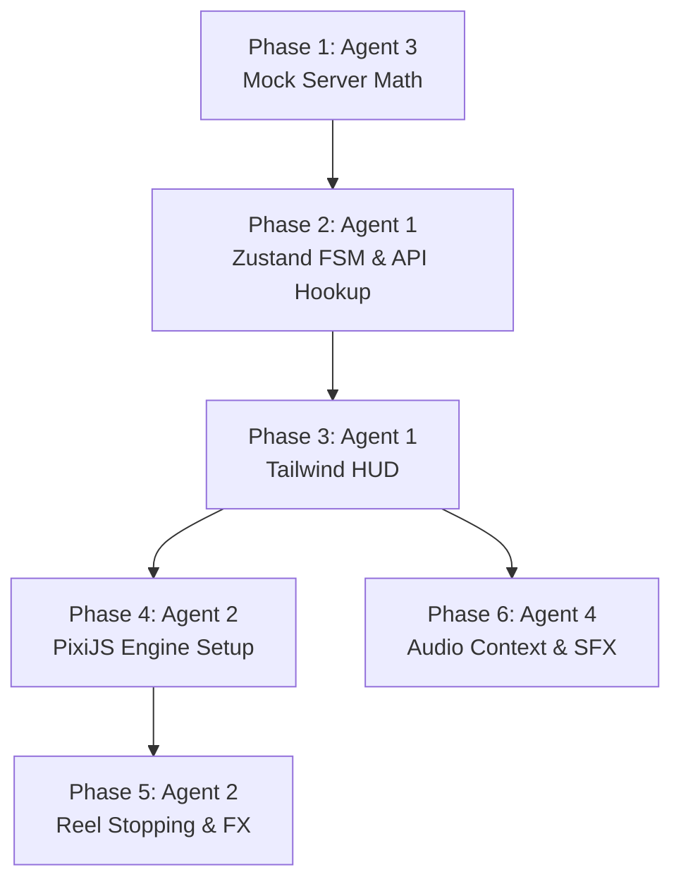

<!-- BEGIN:nextjs-agent-rules -->

# This is NOT the Next.js you know

This version has breaking changes — APIs, conventions, and file structure may all differ from your training data. Read the relevant guide in `node_modules/next/dist/docs/` (resolved from this file's directory; in monorepos the `next` package may not be visible from the repo root) before writing any code. Heed deprecation notices.

This block is written and re-added by `next dev` — verify at `node_modules/next/dist/server/lib/generate-agent-files.js`. Removing it from a diff only re-creates the uncommitted change; committing it with your work keeps the tree clean.

<!-- END:nextjs-agent-rules -->

# AGENTS.md - Multi-Agent Orchestration Protocol

## Overview
This document defines the specialized AI agent personas required to build the iGaming Slot Machine Prototype. Because this project bridges React UI state with a WebGL game loop, tasks must be strictly compartmentalized. 

> [!IMPORTANT]
> If an AI assistant is reading this file: **You must verify which Agent Persona you are currently operating as before generating any code.**

---

## The Universal Contract: `src/types/game.ts`
All agents share this exact data model. It represents the "Dumb Client" architecture where the frontend only reacts to the server.

```typescript
export type GameState = 'IDLE' | 'BET_REQUESTED' | 'SPINNING' | 'RESULT_RECEIVED' | 'PAYOUT_ANIMATION';

export interface SymbolData {
  id: number;
  name: string;
  multiplier: number;
}

export interface WinLine {
  lineId: number;       // e.g., 1 for Top Row, 2 for Middle Row
  symbolId: number;
  positions: number[][]; // [row, col] coordinates of the winning symbols
  payout: number;
}

export interface SpinPayload {
  grid: number[][];      // 3x3 array representing the final symbol IDs
  winLines: WinLine[];
  totalPayout: number;
}
```

---

## Agent Personas

### 🟢 AGENT 1: The "App & State" Architect
**Trigger Prompt:** *"Act as Agent 1 (App & State). Your task is..."*

**Core Focus:**
React 18+, Next.js/Vite environment, Tailwind CSS, Zustand Finite State Machines (FSM), and DOM/UI layer interactions.

**Key Responsibilities:**
- **State Machine Implementation:** Build the `useGameStore` (Zustand). It must strictly enforce the FSM (e.g., a user cannot trigger `spin()` if the state is already `SPINNING`).
- **UI/HUD Development:** Build the DOM overlay using Tailwind. This includes the Balance Display, Bet Amount toggles (+/-), and the main Spin button.
- **Canvas Bridging:** Create the `GameCanvas.tsx` React component. This component mounts the HTML `<canvas>`, creates a `useRef` for it, and triggers the PixiJS initialization function (which Agent 2 will write), passing the Zustand store reference down to the engine.
- **Responsive Layout:** Ensure the React UI handles mobile portrait (controls at the bottom) and desktop landscape (controls on the side/bottom) gracefully.

**Strict Boundaries:**
- 🚫 **NO WEBGL:** You do not write `PIXI.Application`, `Ticker`, or sprite manipulation code.
- 🚫 **NO MATH:** You do not calculate slot outcomes.

---

### 🔵 AGENT 2: The "Engine" Architect
**Trigger Prompt:** *"Act as Agent 2 (Engine). Your task is..."*

**Core Focus:**
PixiJS (v7/v8), HTML5 Canvas, WebGL Rendering, 60FPS Game Loops (`PIXI.Ticker`), Sprite Management, and Mathematical Easing.

**Key Responsibilities:**
- **Engine Lifecycle:** Implement `initGameEngine(canvasRef, storeRef)`. Handle memory management, asset loading, and graceful destruction on unmount to prevent memory leaks.
- **Reel Mechanics (The Illusion):** Build the `ReelManager`. When Zustand state is `SPINNING`, move column sprites downward on the Y-axis and wrap them to the top continuously.
- **Outcome Reconciliation:** Subscribe to the Zustand store. When the state shifts to `RESULT_RECEIVED`, intercept the `SpinPayload.grid`. Calculate the exact easing and destination coordinates to snap the reels to the server's predetermined symbols.
- **Visual Effects (FX):** Build the `FXManager`. If `SpinPayload.totalPayout > 0`, draw bounding boxes or lines over the winning coordinates provided in `winLines`, and trigger a simple particle effect (or scale animation) before notifying Zustand that the animation is complete.

**Strict Boundaries:**
- 🚫 **NO REACT RE-RENDERS:** Do not link PixiJS `Ticker` updates to React state. PixiJS must read from Zustand silently.
- 🚫 **READ-ONLY:** The Engine only reads the outcome. It never decides if the player won.

---

### 🟠 AGENT 3: The "Mock Server" Architect
**Trigger Prompt:** *"Act as Agent 3 (Mock Server). Your task is..."*

**Core Focus:**
TypeScript logic, Probability/RNG Mathematics, Data Structures, and Asynchronous Network Simulation.

**Key Responsibilities:**
- **RNG Math Model:** Build `mockRGS.ts` (Remote Gaming Server). Define a weighted pool of symbols (e.g., "Cherries" appear often, "Diamonds" are rare).
- **Grid Generation:** When the `requestSpin(betAmount)` function is called, generate a random 3x3 grid of symbol IDs.
- **Payline Evaluation:** Scan the generated 3x3 grid for horizontal and diagonal matches. If a match is found, calculate the payout based on the bet amount and symbol multiplier.
- **Latency Simulation:** Wrap the entire execution in an asynchronous `Promise` with a `setTimeout` of 500ms - 1500ms to simulate real-world WebSocket/REST latency before returning the `SpinPayload` to Agent 1.

**Strict Boundaries:**
- 🚫 **NO UI/UX:** You do not know what React or PixiJS is. You are a headless, highly secure server environment.
- 🚫 **PURE FUNCTIONS:** Your math evaluation must be 100% decoupled from any rendering logic.

### 🟣 AGENT 4: The "Audio" Architect
**Trigger Prompt:** *"Act as Agent 4 (Audio). Your task is..."*

**Core Focus:**
Web Audio API, Howler.js, Sound Management, and FSM synchronization.

**Key Responsibilities:**
- **Audio Engine Setup:** Build `AudioManager.ts` utilizing Howler.js for robust, cross-browser audio playback. Manage global mute/unmute and volume controls.
- **FSM Sound Binding:** Subscribe to the Zustand `useGameStore`. Trigger specific sound effects based on state transitions (e.g., play looping "reel spin" sound when `SPINNING`, trigger "win chime" on `PAYOUT_ANIMATION`).
- **Asset Preloading:** Ensure audio assets are preloaded before the game begins to prevent latency during gameplay.

**Strict Boundaries:**
- 🚫 **NO RENDERING:** You do not touch PixiJS or DOM rendering logic.
- 🚫 **NO STATE MUTATION:** You only read the FSM state. You never change `GameState`.

---

## Handoff & Execution Sequence

To the human developer: Run these steps sequentially in your AI IDE.

1. **Phase 1 (Agent 3):** Generate the mock symbols, the RNG math model, and the `mockRGS.ts` async function. Test it with console logs to ensure it returns valid payloads.
2. **Phase 2 (Agent 1):** Build the Zustand FSM. Connect the Spin button to `mockRGS.ts`. Verify that clicking Spin updates the state to `SPINNING`, waits for the latency, and updates to `RESULT_RECEIVED` with the payload.
3. **Phase 3 (Agent 1):** Build out the rest of the Tailwind HUD (Balance, Bet controls).
4. **Phase 4 (Agent 2):** Connect to the React Canvas Ref. Build the `PIXI.Application`, load basic placeholder graphics (colored squares or emojis), and build the infinite scrolling reel logic.
5. **Phase 5 (Agent 2):** Implement the stopping logic that catches the Zustand payload and lands the reels on the exact correct grid.

